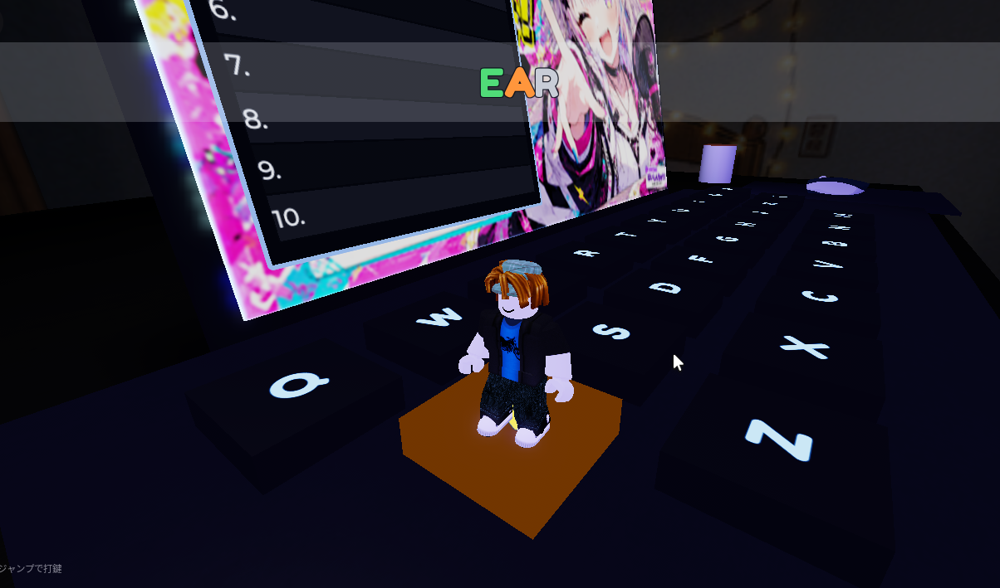

# タイピング3D (Roblox)



小さな主人公（あなたのRobloxアバター）が**巨大なキーボードの上を走り回り**、お題の文字キーまで移動して**ジャンプ着地で打鍵**する3Dタイピング・アクション。真っ暗な部屋でノートPCのディスプレイだけが光る雰囲気の中、コンボを繋いでハイスコアを狙います。

Godot版 3Dタイピングからの Roblox 移植です。

## 遊び方

- **WASD** … 移動（モバイルは画面の移動スティック）
- **SPACE** … ジャンプ（モバイルはジャンプボタン）。次のキーへ移動し、**ジャンプして着地すると打鍵**。
- お題単語の**次に踏むキーが金色に発光**。正しいキーを踏むと進行、違うキーはお手つき（コンボ消滅＋時間ペナルティ）。
- **時間はプラス制**：1本の連続タイマーが減り続け、正解キーごとに時間が加算されます。加算量はレベルが上がるほど小さくなるので、**序盤に速く打って時間を貯金し、終盤は貯金を取り崩して粘る**のがコツ。時間が0でゲームオーバー。
- ハイスコアは**世界ランキング**（ディスプレイ脇の看板）に記録されます。

## 特徴

- ワールド・ゲームロジック・判定はすべて**コードから動的生成／クライアント完結**の1人用設計。
- 暗い部屋＋発光キー＋ノートPC＋360度の部屋背景（円柱内側）で雰囲気を演出。
- PC／モバイル両対応。
- 効果音・BGM・置物・画像は Roblox の Creator Store / Toolbox の素材を使用。

## 技術スタック

- **Roblox** / 言語は **Luau**（`--!strict`）
- **Rojo 7.6.1**（`rokit.toml` でツールを固定）で Studio と接続して開発

## 開発（Rojo + Studio）

1. リポジトリのルートで Rojo サーバーを起動：

   ```bash
   rojo serve
   ```

2. Roblox Studio の Rojo プラグインで **Connect**。以降 `src/` の変更を保存すると Studio に即同期されます（一方向同期。コードは必ず `src/` 側を編集）。
3. Studio で **Play (F5)** して動作確認。

ゼロからプレイスファイルを作る場合：

```bash
rojo build -o "typing3d.rbxlx"
```

詳しくは [Rojo のドキュメント](https://rojo.space/docs) を参照。

## プロジェクト構造

| パス | Studio 上の場所 | 役割 |
|---|---|---|
| `src/shared/` | `ReplicatedStorage.Shared` | サーバー/クライアント共有設定（`GameConfig`：寸法・スコア・単語など） |
| `src/client/` | `StarterPlayerScripts.Client` | ワールド生成・ゲームループ・HUD・効果音（`Keyboard` / `Hud` / `Sounds` / `init.client`） |
| `src/server/` | `ServerScriptService.Server` | 置物アセット配置・世界ランキング（`AssetProps` / `Leaderboard`） |

## クレジット

- 効果音・BGM・小物（マウス/コップ/スマホ）・画像は Roblox の Creator Store / Toolbox 素材を使用。
